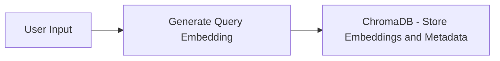
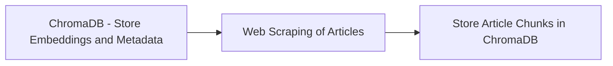
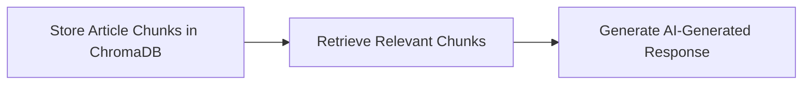

# ChromaQuery: AI-Powered Knowledge Retrieval
ChromaQuery is an AI-powered knowledge retrieval system that integrates retrieval-augmented generation (RAG), web scraping, and ChromaDB for accurate and real-time responses. The system uses OpenAI embeddings and vector search to retrieve relevant articles and generate contextual answers.

The project consists of three parts:  
- RAG (Retrieval-Augmented Generation): Combines document retrieval and language generation to enhance response accuracy using OpenAI embeddings and vector-based search.
- Web Scraping: Extracts and updates content from online sources using BeautifulSoup and requests.
- ChromaDB: Stores and indexes documents and their embeddings for efficient retrieval using semantic search.
# RAG Pipeline Architecture

## Project Architecture

The **ChromaQuery** system follows a modular design that integrates several key components for efficient knowledge retrieval and response generation. Below is an overview of the main architecture:

### **1️⃣ User Input & Query Processing**
- **User Input**: The system starts by accepting a query from the user (e.g., `"Tell me something related to crypto"`).
- **Query Embedding**: The input query is converted into an **embedding** using OpenAI's model, which transforms the text into a numerical vector.

### **2️⃣ Document Retrieval with ChromaDB**
- **Article Fetching**: The system fetches technology-related articles from a predefined source using **web scraping** (via **BeautifulSoup** and **requests**).
- **Metadata & Embedding Storage**: For each article, the system stores the **title, link, and embedding** (semantic vector) in **ChromaDB**, along with metadata for easy retrieval.
- **Persistence**: ChromaDB provides persistent storage to keep document embeddings and metadata across sessions.

### **3️⃣ Relevant Document Search**
- **Query Matching**: Once the user query is embedded, it is matched against the embeddings stored in ChromaDB using **vector-based search** to find the most relevant documents.
- **Top Results**: The system retrieves the top documents based on **semantic similarity** to the query embedding.

### **4️⃣ Web Scraping for Article Content**
- **Full Text Retrieval**: After retrieving relevant article links, the system scrapes the content of these articles (handling multiple sources) to extract detailed information.
- **Text Chunking**: The article content is split into smaller **chunks** for more granular search and indexing.

### **5️⃣ Storing Chunks in ChromaDB**
- **Chunk Storage**: The system stores these article chunks (along with their embeddings) in a new **ChromaDB collection**, ensuring fast access and retrieval.
  
### **6️⃣ Final Response Generation**
- **Answer Synthesis**: The system then queries the **ChromaDB collection** to retrieve the most relevant chunks and generates a **contextual response** using the OpenAI model.

## **Diagram of the Architecture**
### **Get Article & Link**

### **Get Article Content**

### **Retrieve Chunks & Generate Response**

